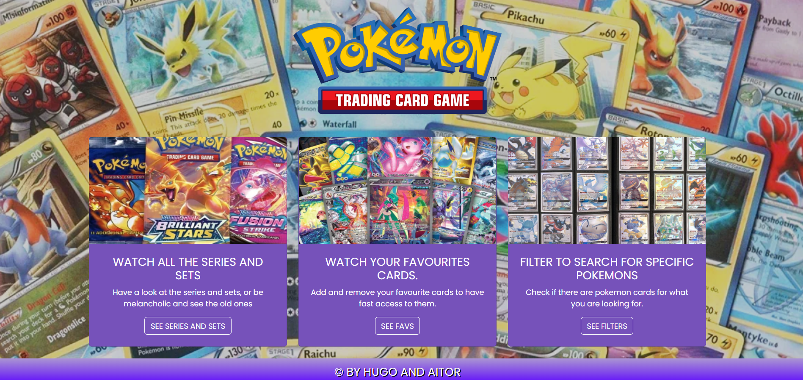
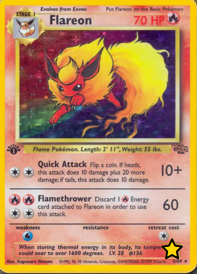

# Pokemon TCG Explorer </img>

### Authors: Aitor and Hugo

## Overview.

The main purpose of the app is to:

- Show Pokémon cards from the TCG card game.
- Filter cards by series and sets.
- Add your favorite cards to a private **Favorites** list via a custom API.

We use a JSON server to save the favorites data in the `db.json` file.

### Live Demo

You can view the live version of the project here:

[](https://aitorbarrera.github.io/pokemon-tcg-webapp/)

## API Integration

#### API Name: TCG dex.

#### Link: [API Url](https://tcgdex.dev/)

#### API Structure:

| **Endpoint**       | **Method** | **Description**                                       | **Example**                                           |
| ------------------ | ---------- | ----------------------------------------------------- | ----------------------------------------------------- |
| `/series`          | `GET`      | Retrieves a list of all series available in the TCG.  | [Example](https://api.tcgdex.net/v2/en/series)        |
| `/series/{series}` | `GET`      | Fetches detailed information about a specific series. | [Example](https://api.tcgdex.net/v2/en/series/base)   |
| `/sets`            | `GET`      | Retrieves all card sets in the TCG.                   | [Example](https://api.tcgdex.net/v2/en/sets)          |
| `/sets/{set}`      | `GET`      | Fetches cards within a specific set.                  | [Example](https://api.tcgdex.net/v2/en/sets/base1)    |
| `/cards/{cardId}`  | `GET`      | Retrieves details for a specific card by its ID.      | [Example](https://api.tcgdex.net/v2/en/cards/base1-4) |
| `/illustrators`    | `GET`      | Lists all illustrators of TCG cards.                  | [Example](https://api.tcgdex.net/v2/en/illustrators)  |

#### Access: We access to the API through the PokemonTCG.js file, where we find the different methods to obtain the information.

We made the fetch with Async/Await.

```javascript
const API_URL = "https://api.tcgdex.net/v2/en";

export async function getAllPokemonCardsBySet(set) {
  try {
    const response = await fetch(`${API_URL}/sets/${set}`);

    // parse the json response
    const data = await response.json();

    return data;
  } catch (error) {
    console.error("Error:", error);
    return null;
  }
}
```

In this file we have 11 functions to get the information we need to filter.

```javascript
export async function getAllPokemonCardsBySet(set){ ...
}

export async function getPokemonCardsById(id){ ...
}


export async function getPokemonCardsByName(name){ ...
}


export async function getPokemonCardsBySuffix(suffix){ ...
}


export async function getSeries(){ ...
}

export async function getSeriesById(id){ ...
}

export async function getSets(){ ...
}

export async function getSetsBySeriesId(){ ...
}

export async function getFilteredCards(set = "base1", name = "", category = "", rarity = "", sortedBy = ""){ ...
}

export async function getCardCount(cardSet){

}

export async function getRarities(cardSet) { ...
  }
```

## Folder Structure
```
├───docs
│   ├───assets
│   └───index.html
├───node_modules
│
└───src
    ├───fonts
    ├───img
    ├───rest_test
    ├───scripts
    │   ├───buttonUp.js
    │   ├───collectionAPI.js
    │   ├───main.js
    │   ├───PokemonTCG.js
    │   └───toastWindow.js
    ├───style
    │   ├───_apexLogo.scss
    │   ├───_buttonUp.scss
    │   ├───_cardContainer.scss
    │   ├───_dropdown.scss
    │   ├───_footer.scss
    │   ├───_ globals.scss
    │   ├───_header.scss
    │   ├───_hero.scss
    │   ├───_layout.scss
    │   ├───_mixins.scss
    │   ├───_navbar.scss
    │   ├───_pokemonCard.scss
    │   ├───_sectionSeries.scss
    │   ├───_variables.scss
    │   └───main.scss    
    ├───db.json
    └───index.html
```
### Purpose of Each Folder

- **`docs/`**: Output directory for the compiled project.
  - This folder contains all the static files (e.g., `index.html`, optimized SCSS, and JavaScript) generated after building the project with Vite.
  - It is used for the deployment on **GitHub Pages**.
  - **`index.html`**: The main entry point for the application.
  - **`assets/`**: Contains additional resources such as images, fonts and SCSS referenced in the app.

- **`node_modules/`**: Managed by npm, this folder contains all the dependencies required for the project to function.

- **`src/`**: Core directory of the project.
  - **`fonts/`**: Contains custom fonts used in the application.
  - **`img/`**: Stores images used in the project, such as the logo or card visuals.
  - **`rest_test/`**: Includes test files for validating API requests and responses, one file for the public API and other for the private one.
  - **`scripts/`**: Containes all the JavaScript files for the app's functionality.
    - **`buttonUp.js`**: Handles the "scroll to top" button.
    - **`collectionAPI.js`**: Manages API calls related to favourites function, so manage the private API.
    - **`main.js`**: Core logic responsible for initializing the application, managing card filtering, and ensuring a seamless Single Page Application (SPA) experience.
    - **`PokemonTCG.js`**: Central file managing interactions with the TCGdex API.
    - **`toastWindow.js`**: Manages toast notifications for user interactions.
  - **`style/`**: SCSS files for styling the application.
    - **`main.scss`**: Main entry point that imports all partial SCSS files.
    - **`_variables.scss`**: SCSS variables for maintaining consistent theming.
    - Other `_*scss` files: Individual styles for specific components or sections of the app.
  - **`db.json`**: JSON server database file for storing user favorites.
  - **`index.html`**: Main HTML file for the application interface.


## App functionality

### Home page 

</img>

In the main page, there are differents cards with buttons, that redirects you to the diferent features of the page.

The series and set button show all the series, and if you click one it show all the sets inside.

</img>
</img>


By clicking one set it shows the cards, and you can add more filters.

</img>

We can also add the cards to favorites using the star button.

</img>

You can see your favourites cards, clicking the FAVOURITE link in the navbar, or in the main page by the button on the card. Both redirects you to this page, where you can delete the cards if you want.

</img>


## Set Up and Run the Application

To run the project locally, follow these steps:

``` bash
git clone https://github.com/AitorBarrera/pokemon-tcg-webapp.git
cd pokemon-tcg-webapp
```

### 2.Install dependencies:

``` bash
npm install
```
### 3.Run the JSON server (for Favorites API):

```bash
npx json-server --watch db.json --port 3000
```
### 4.Start the app:

```bash
npm run dev
```
### 5.Open the app in your browser at http://localhost:5173.

## Contribution
| Team Member | Practice Contribution (%) | Documentation Contribution (%) | Design Contribution (%) | Total Contribution (%) |
|-------------|---------------------------|-------------------------------|-------------------------|------------------------|
| Aitor       | XX%                       | XX%                           | XX%                     | XX%                   |
| Hugo        | XX%                       | XX%                           | XX%                     | XX%                   |
| **Total**   | **100%**                  | **100%**                      | **100%**                | **300%**               |
